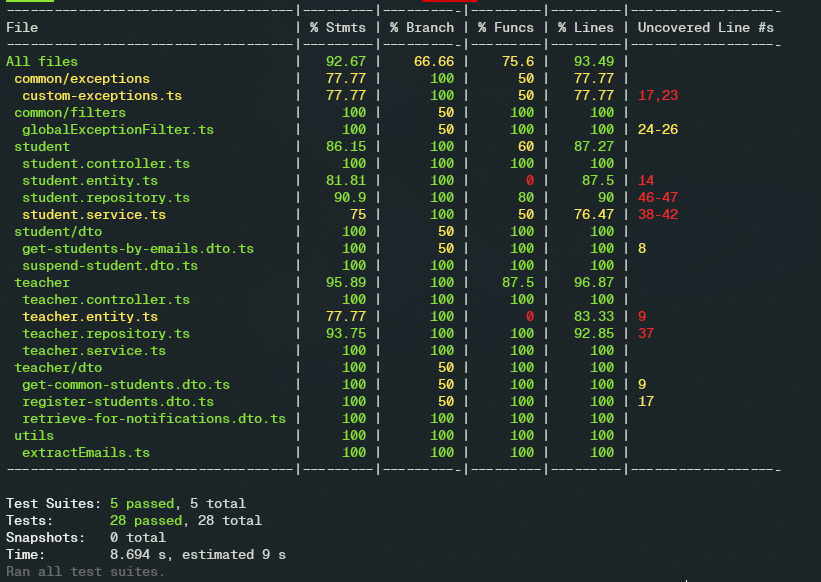
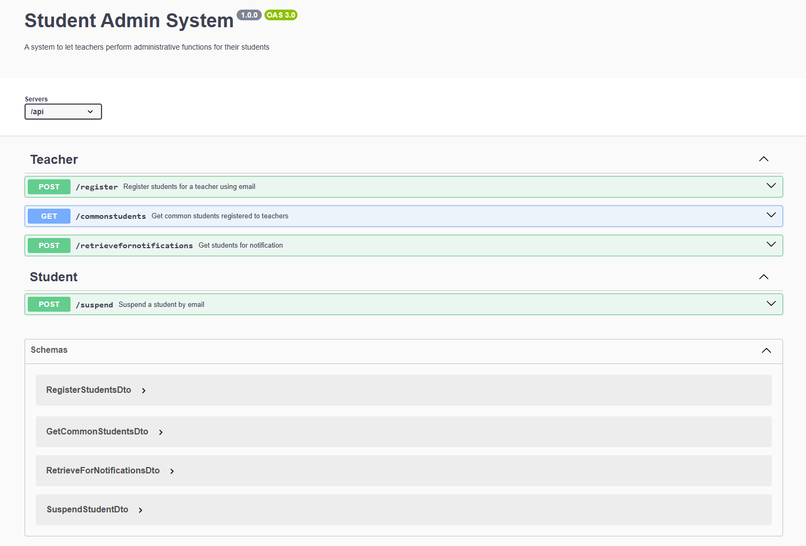
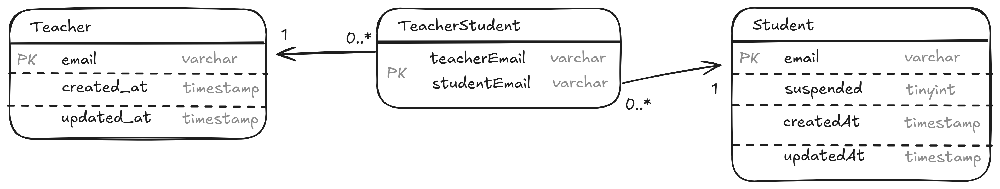

## Table of Contents

- [Technologies used](#technologies-used)
- [Project Structure](#project-structure)
- [Prerequisites](#prerequisites)
- [Installation](#installation)
  - [Run the App](#run-the-app)
  - [Run Unit Tests](#run-unit-tests)
  - [Swagger Documentation](#swagger-documentation)
- [About the Project](#about-the-project)
  - [Models](#models)
  - [Design choices](#design-choices)
  - [Endpoints](#endpoints)

## Technologies Used

- **Backend**: NodeJS, NestJS (powered by ExpressJS)
- **Testing tool**: Jest, supertest, NestJS testing utilities
- **Database**: MySQL, TypeORM
- **Containerization**: Docker engine and Docker Compose

## Project Structure

```
│   app.module.ts                           # main application module
│   main.ts                                 # entry point
├───common                                  # shared resources across the codebase
│   ├───exceptions
│   │       custom-exceptions.ts            # custom exceptions
│   └───filters
│           globalExceptionFilter.ts        # filters for handling uncaught exceptions
│
├───config                                  # configs for main tools/db
│       database.config.ts
│       typeorm.config.ts
│
├───student                                 # student related use cases, endpoints
│   │   student.controller.ts
│   │   student.entity.ts
│   │   student.module.ts
│   │   student.repository.ts
│   │   student.service.ts
│   ├───dto                                 # dto for controller layer/service layer
│   │       get-students-by-emails.dto.ts
│   │       suspend-student.dto.ts
│   └───test                                # unit tests
│           student.controller.spec.ts
│           student.service.spec.ts
│
├───teacher                                 # teacher related use cases, endpoints
│   │   teacher.controller.ts
│   │   teacher.entity.ts
│   │   teacher.module.ts
│   │   teacher.repository.ts
│   │   teacher.service.ts
│   ├───dto                                 # dto for controller layer/service layer
│   │       get-common-students.dto.ts
│   │       get-teacher-by-email.dto.ts
│   │       register-students.dto.ts
│   │       retrieve-for-notifications.dto.ts
│   └───test                                # unit tests
│           teacher.controller.spec.ts
│           teacher.service.spec.ts
│
├───types
│       constants.ts
│       errorCodes.ts
└───utils
        extractEmails.spec.ts
        extractEmails.ts
```

## Prerequisites

Ensure that you have the following installed:

- [Docker](https://www.docker.com/get-started/) and [Docker Compose](https://docs.docker.com/compose/install/)
- Clone the repository and navigate to the project directory:

  ```bash
  git clone git@github.com:akitak1290/nestjs-pai-learning-pj.git
  cd nestjs-pai-learning-pj
  ```

## Installation

### Run the App

#### 1. Build and start the containers

Run the follow command to start the containers:

```bash
docker-compose up --build
```

This will setup:

- A MySQL server in a container with a mounted volume for persistent storage
- Seed the database with initial data (`./seed.sql`)
- Setup a NodeJS environment and the API server in another container
- Run the server to listen on port 3000

#### 2. Access the API server

The application is available at:

```
http://localhost:3000
```

#### 3. Interact with the database

First, open an interactive shell session inside the MySQL container

```
docker exec -it mysqldb sh
```

To access MySQL's shell, use the credentials and port listed in `.env`

```
mysql -h 127.0.0.1 -P 3306 -u root -ppassword school
```

Once in the shell, you can query the database (default db name is 'school')

```
show tables;
select * from students;
```

#### 4. Delete the containers

Delete the containers and clean out the volume by running

```
docker-compose down -v
```

### Run Unit Tests

Similarly, open another interactive shell session inside the api server container and execute the test runner



```bash
docker exec -it api_server npm run test
```

### Swagger Documentation

After setting up the server container, go to [/api](http://localhost:3000/api/) to view the Swagger documentation.



## About the Project

The project is built around 2 data models `Student` and `Teacher` represented by their corresponding entities. TypeORM was chosen to interact with the MySQL database. All main functionalities involve around managing the relationship between the two models, including handling registration, get common students, get notification list, and suspend a student.

### Models

We delegate management of the tables to TypeORM, including the creation and handling of the bridge table TeacherStudent. The underlying database has following structure:



(timestamp fields are also created and managed by TypeORM)

#### The Teacher Model

Represents the teachers in the system, manages multiple student entities.

- email: the primary key that uniquely identifies a teacher
- students: a relation field representing a list of student entities that the teacher manages

#### The Student Model

Represents the students in the system, can be registered to multiple teacher entities.

- email: the primary key that uniquely identifies a student
- suspended: a boolean value indicating if a student is suspended or not
- teachers: a relation field representing a list of teacher entities the student is registered to

#### The TeacherStudent Model

Facilitate the many-to-many relationship between the Teacher and Student entities by storing the association between their email addresses

- teacherEmail: a foreign key referencing a row in the Teacher table
- studentEmail: a foreign key referencing a row in the Student table

Both foreign keys creates a composite primary key that uniquely identifies a relationship in the table. TypeORM automatically manages and maintains the table and the relationship between the Student and Teacher tables.

### Design Choices

The API endpoints are separated into 2 controllers, driven by several considerations:

1. **Separation of Concerns**:

   - **TeacherController**: Manages teacher-specific actions like registering students, retrieving common students among teachers, and other potential actions that directly updates the Teacher table.
   - **StudentController**: Handles student-specific operations such as suspending students that directly updates the Student table.
   - This design also closely models real world applications when there are more endpoints with multiple modules.

2. **Scalability**:

   - By segmenting endpoints, we can easily scale each module independently. This modularity follows NestJS's design choice, ensures that new features can be added without causing disruptions to the existing functionality

3. **Maintainability**:
   - Keeping related logic within its specific controller makes the codebase more maintainable.

The approach trades simplicity of putting everything in the teacher's module for clear separation of concerns, enhancing scalability and maintainability.

### Endpoints

#### Register Students

- **Endpoint:** `POST /api/register`
- **Headers:** `Content-Type: application/json`
- **Success Status:** 204
- **Request Body:**
  - `teacher`: Email of the teacher.
  - `students`: List of student emails.

#### Retrieve Common Students

- **Endpoint:** `GET /api/commonstudents`
- **Success Status:** 200
- **Query Parameters:**
  - `teacher`: One or more teacher emails.
- **Success Response Example:**
  ```json
  {
    "students": ["commonstudent1@gmail.com", "commonstudent2@gmail.com"]
  }
  ```

#### Suspend a Student

- **Endpoint:** `POST /api/suspend`
- **Headers:** `Content-Type: application/json`
- **Success Status:** 204
- **Request Body:**
  - `student`: Email of the student.

#### Retrieve for Notifications

- **Endpoint:** `POST /api/retrievefornotifications`
- **Headers:** `Content-Type: application/json`
- **Success Status:** 200
- **Request Body:**
  - `teacher`: Email of the teacher.
  - `notification`: Text of the notification.
- **Success Response Example:**
  ```json
  {
    "recipients": ["student1@gmail.com", "student2@gmail.com"]
  }
  ```

#### Error Responses

- **Error Response Example:**

```json
{
  "errorType": "BadRequestException",
  "statusCode": 400,
  "message": [
    "each value in teacher must be an email",
    "teacher must contain at least 1 elements",
    "teacher must be an array"
  ]
}
```
